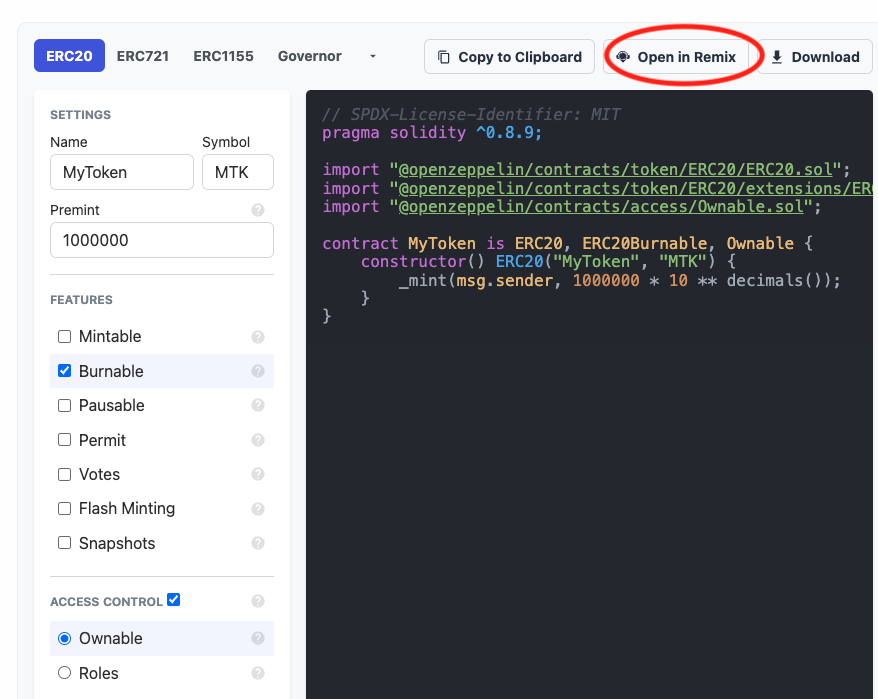
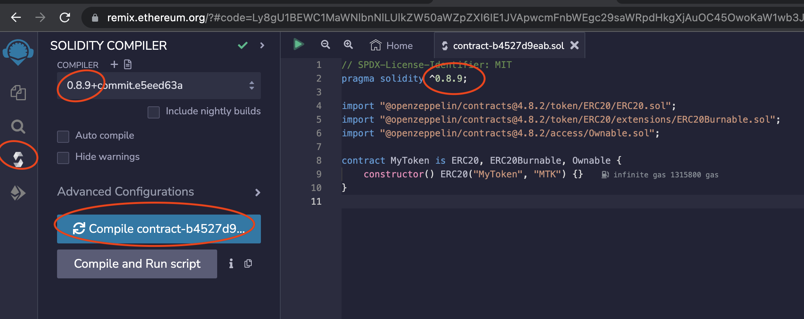
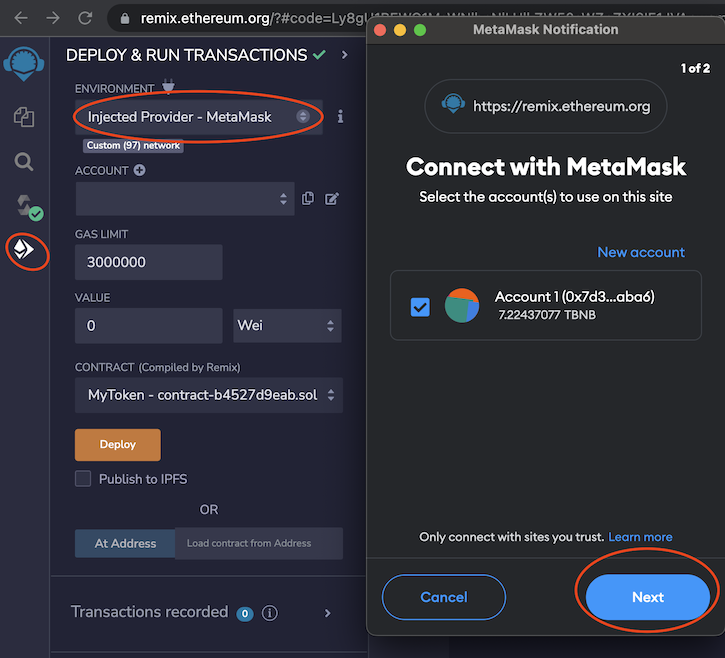
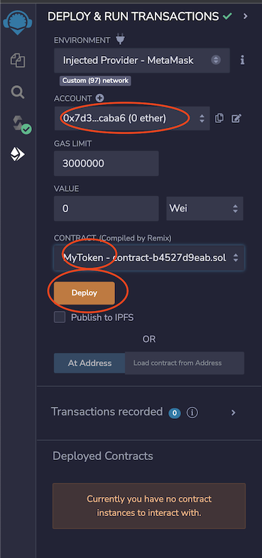
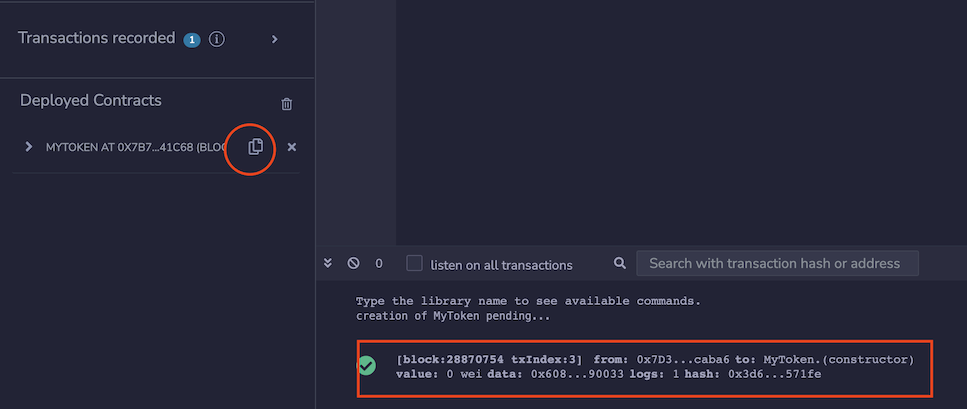
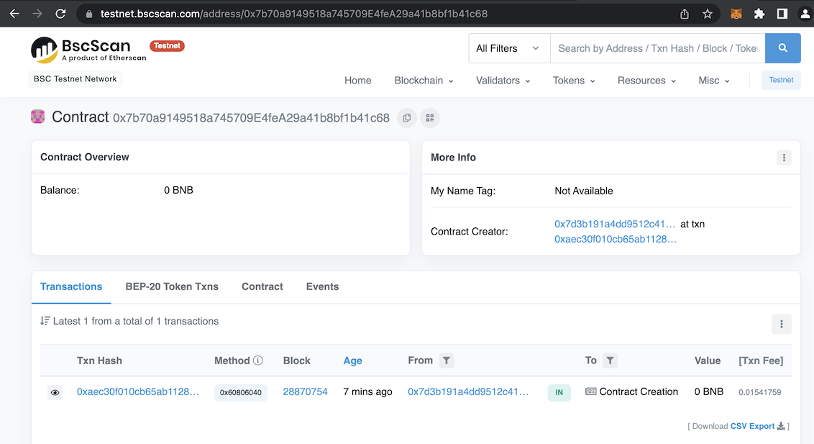
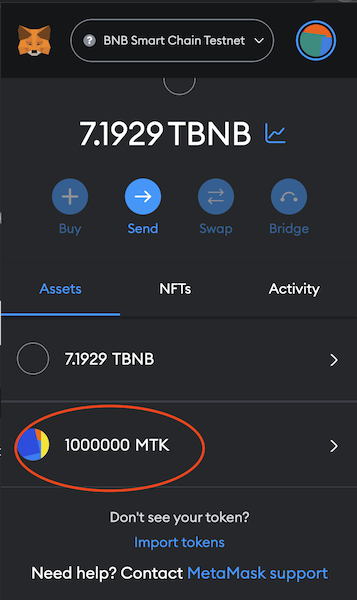

# Create your ERC20 token at BSC Testnet 创造您的ERC20代币在BSC测试链

1. goto https://docs.openzeppelin.com/contracts/4.x/wizard
1. select 'ERC20',
* You can change name & symbol
* Premint you can put any amount.
* Check 'Burnable'
* Check 'Ownable'

1. Click 'Open in Remix'
1. Compile your solidity code. Ensure you select correct compiler.

1. Deploy your contract. Ensure you select 'Injected Provider - Metamask', then your metamask will popup, you click 'Next' button

1. You will see your wallet address here. Ensure you select your token ('MyToken') and click 'Deploy' button

 
1. You copy the contract address and search at testnet.bscscan.com

1. Open your metamask, click 'Import Token' to import your token

