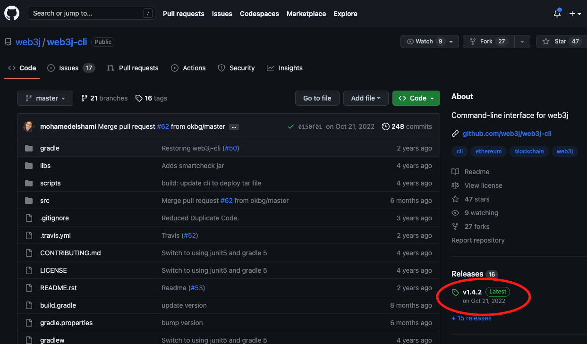
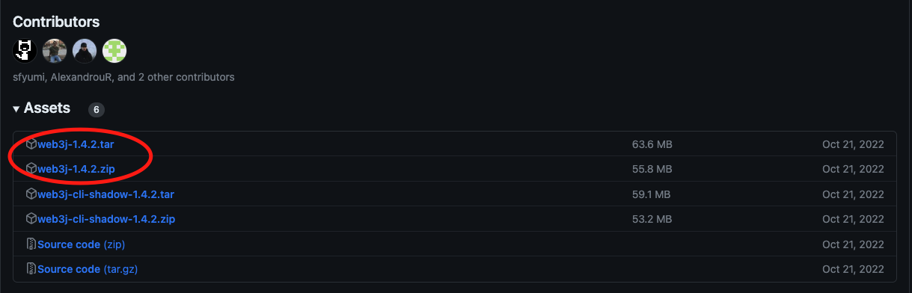
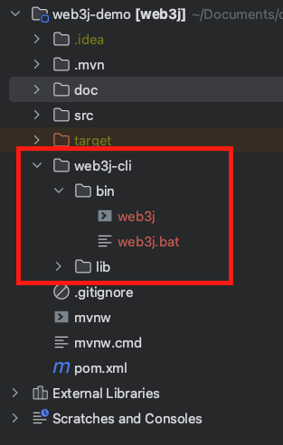
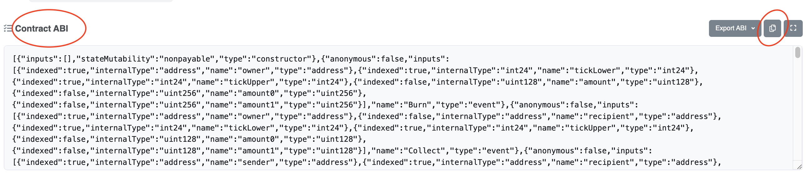
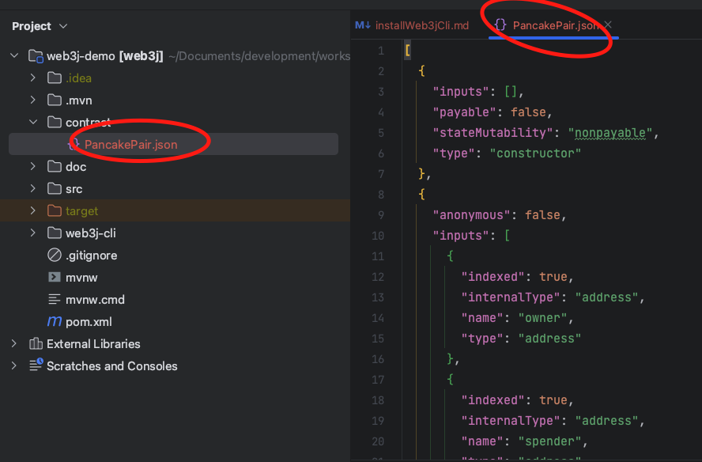
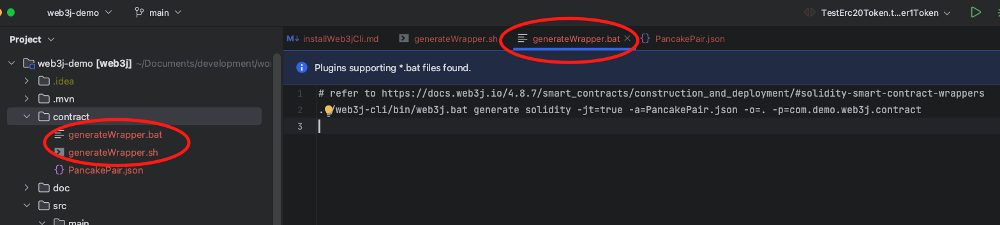
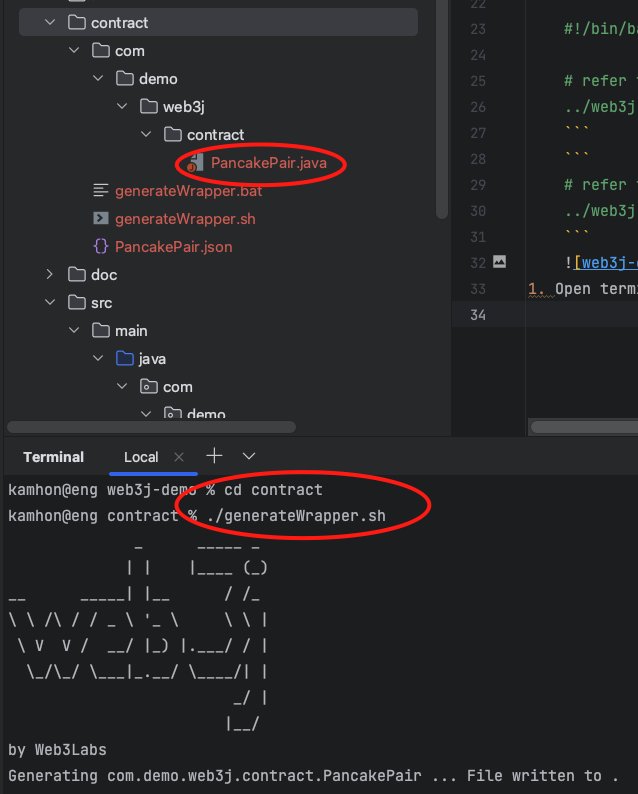
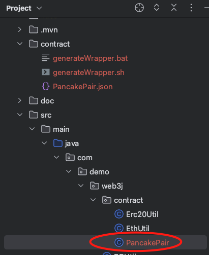
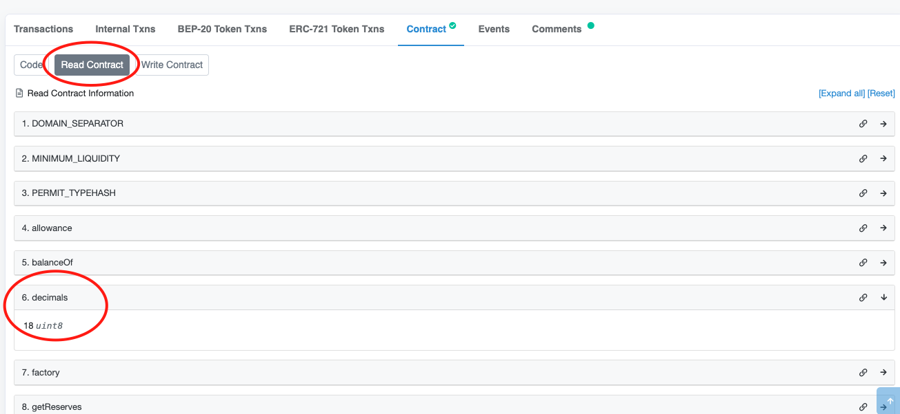

# Download Web3j-cli
1. download web3j-cli from https://github.com/web3j/web3j-cli    


1. unzip and put into your project. Eg: unzip and rename folder to web3j-cli  


# How to create java wrapper class for PancakeSwap V2 Pair. 
1. We use USDT / WBNB pair as example. https://pancakeswap.finance/info/pairs/0x16b9a82891338f9ba80e2d6970fdda79d1eb0dae
1. for your information, 0x16b9a82891338f9ba80e2d6970fdda79d1eb0dae will be the contract address. 

## Get ABI from bscscan.com
In order to get ABI, the smart contract need to verify and upload the solidity source code.
1. Search the contract address bscscan.com. Browse https://bscscan.com/address/0x16b9a82891338f9ba80e2d6970fdda79d1eb0dae#code
   * Click on 'Contract' tab, scroll down until you see 'Contract ABI'. Click 'Copy' button.  
   
1. create a json file with file name PancakePair.json, paste the ABI into PancakePair.json.
   * You can format the json file too.  
   
1. Create bat file (generateWrapper.bat) or sh file (generateWrapper.sh) to generate Java Wrapper class.
    ```
    #!/bin/bash
    
    # refer to https://docs.web3j.io/4.8.7/smart_contracts/construction_and_deployment/#solidity-smart-contract-wrappers
    ../web3j-cli/bin/web3j generate solidity -jt=true -a=PancakePair.json -o=. -p=com.demo.web3j.contract
    ```
    ```
    # refer to https://docs.web3j.io/4.8.7/smart_contracts/construction_and_deployment/#solidity-smart-contract-wrappers
    ../web3j-cli/bin/web3j.bat generate solidity -jt=true -a=PancakePair.json -o=. -p=com.demo.web3j.contract
    ```
    
1. Open terminal and run generateWrapper.bat or generateWrapper.sh. You will see PancakePair.java generated. 
   
1. Move PancakePair.java to src/main/java/com/demo/web3j/contract  
   


## How to call 'Read' function from ABI
1. We try to call 'decimals' function  
   
1. For java unit test, please refer to TestPancakePair.java

## Notes:
1. Please take note that PancakePair contract address is at mainnet and our erc20 token (MTK) is at testnet 
