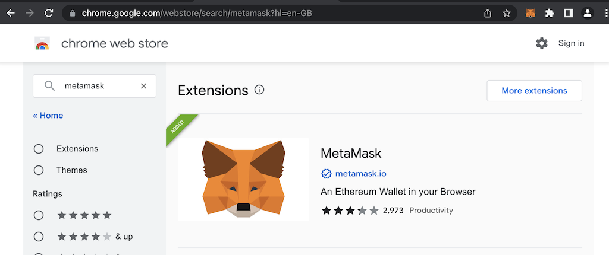
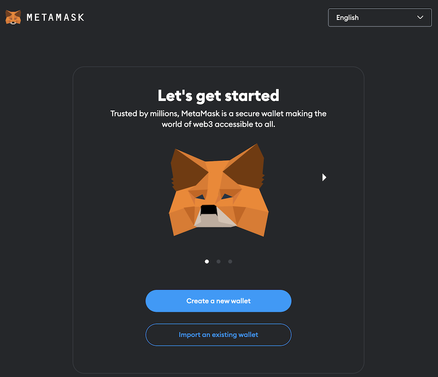
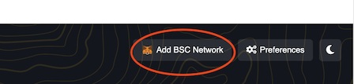
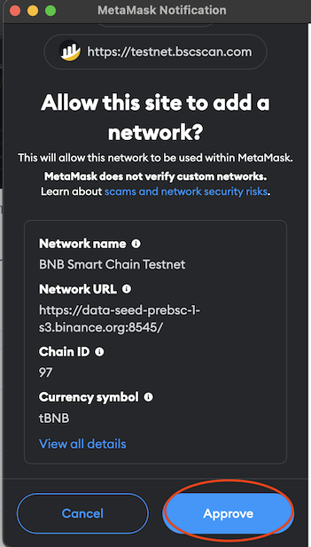
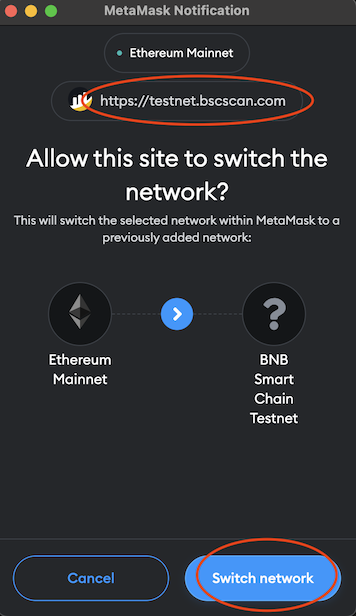
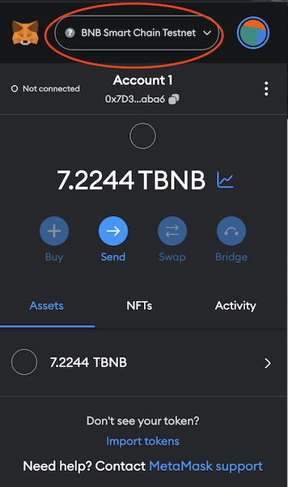

# install metamask extension at Google Chrome 安装metamask在Google Chrome游览器

## open url with Google Chrome 游览
https://chrome.google.com/webstore/search/metamask?hl=en-GB

## install metamask 安装metamask

## add BSC Testnet RPC url into metamask 增加BSC测试网RPC URL到metamask
1. browse https://testnet.bscscan.com/
1. scroll page to end of bottom, click 'Add BSC Network'  
     
1. click 'Approve' button  
  
1. Click 'Switch Network' to 'BSC Testnet'  
     
   

## Request BNB coin for BSC Testnet
1. browse https://testnet.bnbchain.org/faucet-smart and put your wallet address
